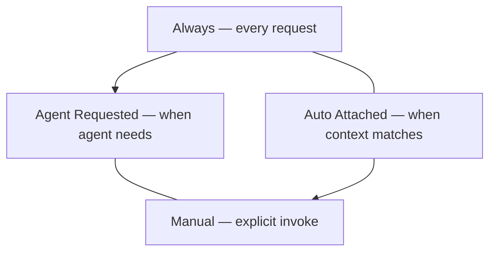
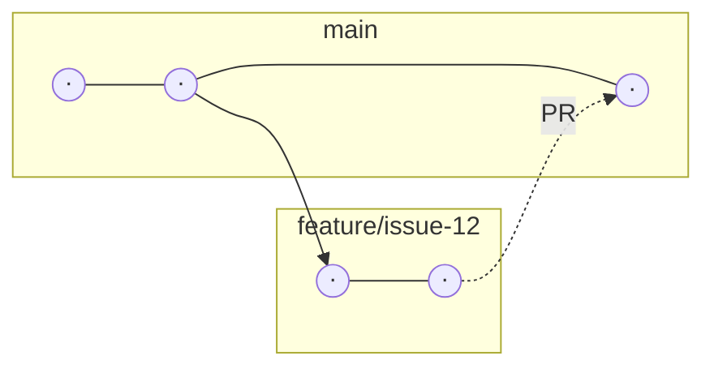

# Agentic Coding for Economists
## Day 1: Setup, GitHub Foundations, Capstone Start

https://agentic-coding-for-economists.vercel.app/i/bac

**Antonio Mele**  
London School of Economics  
<span style="font-size:0.72em">Workshop at Università di Milano-Bicocca</span>  

April 7–10, 2026

---

# What is Agentic Coding?

**Agentic coding** = delegating implementation work to AI agents that **read**, **plan**, **edit**, and **verify**—while you orchestrate scope, context, and quality gates.

- Agents operate on your codebase with tools (edit files, run commands, search)
- You control what they see (`.cursorignore`, @mentions) and how they behave (rules, `AGENTS.md`)
- Output is **verifiable**: tests, reproducibility checks, PR reviews

---

# Why Economists Need Agentic Coding

- **Pipeline complexity**: Data loading → cleaning → estimation → tables/figures → paper. Many small, automatable steps
- **Reproducibility pressure**: Journals and replicators expect clean code, documented data, one-command runs
- **Time-to-insight**: AI accelerates boilerplate (documentation, tests, LaTeX tables) so you focus on design and interpretation
- **Multi-artifact projects**: Code + paper + appendix + replication package. Agents keep them consistent

---

# Workshop Agenda (April 7–10)

**Day 1: Setup, GitHub Foundations, Capstone Start**
1. **Modes & governance:** Agent/Ask/Plan/Debug; `.cursor/rules/`, `AGENTS.md`, `.cursorignore`
2. **GitHub workflow:** Issue → branch → PR → merge; labeled backlog
3. **Context control:** `@` mentions, tight vs wide scope
4. **Capstone:** Start project work (demo + sprint blocks; paced across the week)

**Day 2: Research Pipeline Sprint**
1. **Spec-driven development:** Research question into a structured pipeline (intent → requirements → design → tasks)
2. **Context control deep dive:** Tight paths, web search for literature, `@Docs` for APIs
3. **Literature mapping:** AI-assisted BibTeX generation and review structure
4. **Verification loops:** Vague tasks → acceptance criteria → fail-fix-rerun

**Day 3: Parallel Agent Execution Sprint**
1. **MCP:** Model Context Protocol — FRED API, filesystem, Stata/MATLAB/R on your machine, when it adds value
2. **Subagents:** Specialized agents for recurring roles (reviewer, replicator, bibliographer)
3. **Agent Skills:** Reusable workflows with `SKILL.md` and skill-creator principles
4. **Cloud Agents:** Remote execution, branch handoff, review-before-merge
5. **Swarm orchestration:** Multiple coordinated agents — GitHub issues, labels, parallel vs sequential Cloud Agent runs

**Day 4: Integration, Replication, Presentation**
1. **Replication protocol:** Clean-run checklist, fail-fix-rerun cycle
2. **Packaging:** README-first approach, sensible project structure, documented dependencies
3. **Post-workshop experiments:** Ideas to try individually or with colleagues over the next few weeks
4. **Wrap-up:** Transferable patterns, next steps

*Day 3 DoD:* full harness, prototype, consistency log, merged PRs. *Day 4:* mini replication package, replication README, 5–7 min talk.

---

# Demo-First Philosophy

**How we teach:**
1. **~45–60 min demo**: One tactical workflow, live
2. **~60–75 min sprint**: Apply immediately; coach as needed
3. **Break**
4. **Repeat**: second demo block (same rhythm) → second sprint; scope correction as needed

**Today:** Cursor modes, rules, GitHub workflow, context control—then capstone start (paced across the sprints)

---

# Day 1: Sprint 1

---

# Cursor Modes Overview

| Mode | Behavior |
|------|----------|
| **Agent** | Read + write, runs commands, creates files |
| **Ask** | Read-only, explains and suggests (no edits) |
| **Custom** | Your own prompt/mode config |
| **Plan** | Breakdown before implementation |
| **Debug** | Systematic bug hunting |

**Rule of thumb:** Use **Ask** when you want to explore or verify. Use **Agent** when you want files changed and tasks automated.

---

# When to Use Each Mode

| Task | Mode | Reason |
|------|------|--------|
| "What's the Gini formula for grouped data?" | Ask | Research, no edits |
| "Add Gini to `src/utils/`" | Agent | Implementation |
| "Break down IV pipeline into steps" | Plan | Multi-step design |
| "Why does this test fail?" | Debug | Systematic diagnosis |
| "Refactor across 5 files" | Plan → Agent | Scope first |

*Economists:* Use Ask for literature/formula checks; Agent for estimation scripts, tables, tests.

---

# Mode Comparison Diagram

```mermaid
flowchart TD
    T[Same task: "Add Gini function"]
    T --> A[Ask: Code + explanation]
    T --> B[Agent: Edits files, runs tests]
    T --> P[Plan: Steps first]
    A --> A1[Copy-paste]
    B --> B1[Automated]
    P --> P1[Then Agent]
```

---

# Ask vs Agent: Same Task, Different Output

**Ask mode** — research/exploration: You get code in chat; you copy-paste.

```python
# You get code in chat; you copy-paste
def gini(values: list[float]) -> float:
    """Standard Gini formula"""
    ...
```

**Agent mode** — implementation:
- Creates `src/utils/inequality.py`
- Adds `tests/test_gini.py`
- Runs `pytest`

*Both valid; choice depends on "think" vs "do."*

---

# Rule Types Diagram



Arrows connect **between** boxes along the left and right columns—not through a containing bubble.

**Use sparingly:** *Always* for critical constraints only (e.g., "never expose API keys").

**Globs** tie rules to file types: `**/*.py`, `**/*.tex`

---

# .cursorignore: Privacy & Performance

**What it does:** Controls what Cursor **indexes** and can send as context.

- **Privacy**: API keys, microdata, unpublished results
- **Performance**: Large CSVs, PDFs, `.venv`
- **Relevance**: Cache, intermediates

**Different from `.gitignore`:** `.gitignore` = version control | `.cursorignore` = AI context

**Economics patterns:**
```
data/
.env
*.dta
*_confidential*
```

---

# Day 1: Sprint 2

---

# AGENTS.md Structure

**Purpose:** "Front door" for any agent: human-readable project brief at repo root.

```markdown
# Agent Instructions — [Project Name]

## Project context
This repo implements [brief description]. Research question: [one sentence].

## Code standards
- Python 3.10+; Ruff for formatting.
- See `.cursor/rules/` for detailed conventions.

## Key paths
- `src/` — core code
- `data/` — input data (never commit raw)
- `outputs/` — results, figures

## What to avoid
- Do not hardcode paths or API keys.
```

---

# Example Rules for Economics

**Python economics** (`.cursor/rules/python-economics.mdc`):
- Type hints, Google-style docstrings
- Prefer `pandas` for tabular data, `numpy` for arrays
- Include unit tests for estimation/utility functions

**LaTeX conventions** (`.cursor/rules/latex-conventions.mdc`):
- `natbib` with `\citet` / `\citep`
- `siunitx` for numbers in tables
- Figures in `figures/`, tables in `tables/`

---

# Issue → Branch → PR → Review → Merge

*Issue opens work* — **`main`** keeps moving while **`feature/issue-12`** advances in parallel; a **PR** merges back after review.



**Parallel work:** `main` continues; your fix lives on `feature/…` until a PR merges it.

**Agentic pattern:** One issue per deliverable → one agent per issue → PR → consistency check before merge

---

# GitHub and git

---

# GitHub Workflow: Commands

```bash
git clone <repo_url>
git checkout -b feature/issue-12-literature-map
git add .
git commit -m "Add first literature mapping script"
git push -u origin feature/issue-12-literature-map
```

- **`git clone`** — Copy the remote repo locally.
- **`git checkout -b`** — Create and switch to a new branch for the issue.
- **`git add`** — Stage files for the next commit.
- **`git commit`** — Record a snapshot with a message.
- **`git push -u`** — Publish the branch and set upstream tracking.

**Without typing git:** Use Cursor’s **Source Control** view (branch, commit, push) and GitHub-backed PR flows when the repo is connected.

**Agent + CLI:** Ask the agent to run **`gh`** (e.g. `gh pr create`) if you prefer GitHub CLI automation.

Then: open or finish the PR on GitHub; request review (or run a review agent); merge after checks.

---

# Issue Labels for Economics

| Label | Use for |
|-------|---------|
| `research-question` | Framing, hypothesis refinement |
| `literature` | BibTeX, literature map |
| `data` | Sourcing, cleaning, schema |
| `model` | Theoretical setup |
| `estimation` | Code, robustness |
| `writing` | Paper, appendix |
| `consistency-check` | Review, replication gate |

**Day 1 goal:** ≥ 8 issues with labels; complete 1 end-to-end.

---

# PR Anatomy

- **Title**: "Add Gini utility (#12)"
- **Description**: What changed, why; link to issue
- **Files changed**: Scope review
- **Checklist**: Tests pass? Reproducibility OK?

**Before merge:** Consistency pass + replication sanity check (we'll deepen this on Days 2–4).

---

# @mentions Overview

| @mention | Purpose |
|----------|---------|
| `@Codebase` | Search project; "stay within this repo" |
| `@Web` | Web search (literature, formulas, API docs) |
| `@Docs` | Library documentation (pandas, numpy, etc.) |
| `@Files` | Specific file(s) for grounded tasks |
| `@Folder` | Scope to a directory |

*More specific context* → *more accurate, less hallucinated* output.

---

# Tight vs Wide Context

**Tight context:**
> "`@File:src/utils/inequality.py` — Fix only the edge case when input is empty."

→ Precision, reproducibility, minimal diff.

**Wide context:**
> "`@Codebase` — Add Gini support across all analysis scripts that use income data."

→ Consistency, integration, broader scope.

**Economists:** Tight for fixes/refactors; wide for cross-file coherence.

---

# Codebase Queries

**Examples:**
- "`@Codebase` — Where do we load survey data?"
- "`@Codebase` — Trace how we compute summary statistics."
- "`@Web` — What is the Gini formula for grouped data?"

**Verification:** After adding `.cursorignore`, ask "Can you access `data/`?" — AI should indicate exclusion.

---

# Definition of Done for Day 1

1. **Project brief**: 1-page `docs/project_brief.md`
2. **Issue board**: ≥ 8 issues with labels
3. **Governance**:
   - `.cursor/rules/*.mdc`
   - `AGENTS.md`
   - `.cursorignore`
4. **First commit and push**: At least 1 merged PR (branch → PR → merge)
5. **Artifacts**: `notes/modes_playbook.md` (optional but recommended)

---

# Day 1 Deliverables Checklist

- [ ] Repo created or forked
- [ ] ≥ 8 issues with labels
- [ ] `.cursor/rules/` with at least 1 project rule
- [ ] `AGENTS.md` at repo root
- [ ] `.cursorignore` with data/env/cache exclusions
- [ ] `docs/project_brief.md` (v1)
- [ ] 1 merged PR

---

# Day 2 Preview

**Research Pipeline Sprint**

- Spec-driven development: intent → requirements → design → tasks
- Context control deep dive: tight patterns, `@Web` for literature, `@Docs` for APIs
- Literature mapping with AI: workflow, BibTeX, review structure
- Verification loops: acceptance criteria, consistency checks, fail-fix-rerun

**Deliverables:** Research design memo, `bibliography.bib`, prioritized task list.
