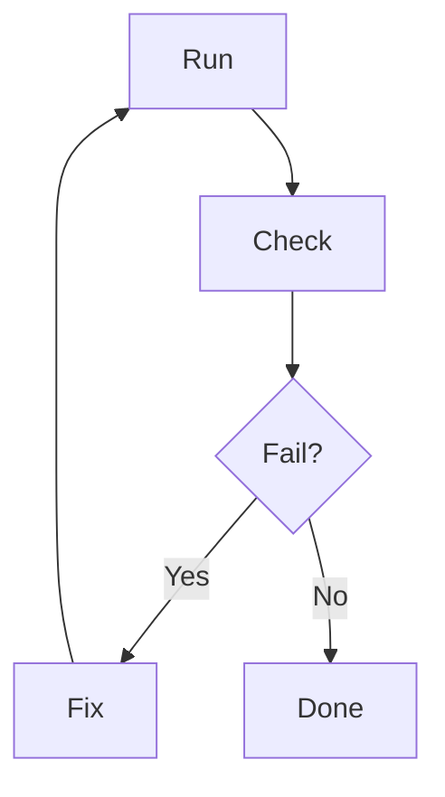

# Agentic Coding for Economists
## Day 2: Research Pipeline Sprint

**Antonio Mele** | Università di Milano-Bicocca  
April 7–10, 2026

---

# Day 1 Recap

- **Cursor modes**: Agent, Ask, Plan, Debug; when to use each
- **Rules & governance**: `.cursor/rules/*.mdc`, `AGENTS.md`, `.cursorignore`
- **GitHub workflow**: Issue → Branch → PR → Review → Merge
- **Context control**: @mentions, tight vs wide scope

**Artifacts**: Project brief, issue board (≥ 8), 1 merged PR

---

# Day 2 Goals

1. **Spec-driven development**: Turn a research question into a structured pipeline (intent → requirements → design → tasks)
2. **Context control deep dive**: Tight patterns, `@Web` for literature, `@Docs` for APIs
3. **Literature mapping**: AI-assisted BibTeX generation and review structure
4. **Verification loops**: Vague tasks → acceptance criteria → fail-fix-rerun

---

# SDD Lifecycle


- **Intent** — The *why*: research question, audience, success criteria in plain language (“what decision or claim should this support?”). Not code yet.
- **Requirements** — The *musts*: testable statements (often EARS): what must hold *when* someone runs the pipeline, *given* fixed inputs.
- **Design** — The *how*: estimators or equations, data flow, software map, robustness paths.
- **Tasks** — The *do now*: small issues with acceptance criteria, mapped to requirements or design slices.

---

# EARS (Easy Approach to Requirements Syntax)

Lightweight pattern language for **unambiguous, testable** requirements.

- **Modal verbs**: `SHALL` = mandatory; `SHOULD` = recommended; `MAY` = optional.
- **Patterns**: **WHEN** trigger, the system SHALL … · **WHERE** constraint, … · **IF** precondition **THEN** … · **GIVEN** context, the system SHALL …

---

# Three flavors of economics (illustration)

1. **Applied empirical** — Intent: causal effect of policy X on Y. Requirements: reproducible panel, treatment timing, pre-specified estimators. Design: clean → DiD/RD/IV → tables.
2. **Applied theory / structural** — Intent: equilibrium or comparative statics with frictions. Requirements: convergence tolerances; equilibrium residuals < ε. Design: state space → value/policy iteration → simulated moments.
3. **Macro (DSGE / HANK)** — Intent: shock transmission. Requirements: calibration targets; IRFs with metadata. Design: solve SS → perturbation → IRFs / variance decomposition.

---

# Mapping SDD to Economics Research

| SDD stage | Economics artifact |
|-----------|-------------------|
| Intent | Research question, contribution, scope (empirical vs theory vs quantitative macro) |
| Requirements | Reproducibility rules, data contracts, numerical tolerances, output schemas |
| Design | Data flow or model blocks; estimation vs simulation; robustness plan |
| Tasks | Issue backlog (data, model code, estimation, figures, replication) |

**Day 2 deliverables** (full SDD chain; artifacts may live in **separate files** linked from the hub memo):

- **Intent** — e.g. `docs/intent.md` or Intent block in `docs/research_design_memo.md`
- **Requirements** — numbered REQ-* in memo or `docs/requirements.md` (EARS-style)
- **Design** — `docs/design.md` or pipeline/model section
- **Tasks** — GitHub issues (or `docs/tasks.md`) with acceptance criteria
- **Hub**: `docs/research_design_memo.md` summarizes and *links* to the above when they grow large

---

# SDD Example: Hub memo (+ optional linked files)

```markdown
# Research Design: Minimum Wage and Employment

## Linked artifacts (optional)
# docs/requirements.md - full EARS REQ list
# docs/design.md - data flow + estimator choices
# docs/tasks.md - issue IDs and milestones

## Intent
Estimate causal effect of minimum wage on county employment (diff-in-diff).

## Requirements (excerpt)
- [REQ-1] WHEN replication runs, SHALL reproduce tables/figures (hash or diff)
- [REQ-2] GIVEN BLS inputs, SHALL produce balanced panel + treatment timing

## Design
1. BLS data -> county-month panel
2. Treated units (early adopters); TWFE DiD
3. Event study + robustness windows

## Tasks (prioritized)
- #1 Data source map  #2 Panel script  #3 DiD  #4 Replication README
```

---

# Agent Skills (Day 3 preview)

- **What:** **Agent Skills** are reusable instructions (typically `SKILL.md`) that tell Cursor *when* and *how* to run a workflow---the same SDD ideas as today, packaged for the agent.
- **For you:** An instructor-provided **SDD** (spec-driven development) skill will be shared so you can reuse intent → requirements → design → tasks inside the IDE.
- **Depth:** Installing skills, authoring, and combining them with subagents and parallel runs is **Day 3**.

---

# Tight Context Patterns

**Pattern 1: Single-file scope (empirical)**
> "`@File:src/estimation/did.py` — Add cluster-robust SEs at the county level."

**Pattern 2: Single-file scope (theory / structural)**
> "`@File:src/model/bellman.py` — Vectorize value-function iteration; do not change `parameters.yaml`."

**Pattern 3: Folder scope**
> "`@Folder:references/` — Check citation consistency with our BibTeX."

**Pattern 4: Explicit exclusion (macro pipeline)**
> "Modify only `scripts/run_dsge_irf.py`; do not touch `models/` mod files until calibration is frozen."

---

# @Web for Literature

**Use cases:**
- "`@Web` — Recent DiD papers on minimum wage (2020–2025)?"
- "`@Web` — Existence proofs or algorithms for equilibrium in random search models with heterogeneous firms?"
- "`@Web` — Dynare vs Julia for medium-scale DSGE with financial frictions?"
- "`@Web` — BibTeX for [Author (Year)]; AER-style journal abbreviations."

**Prompt scaffolding**: "BibTeX + 2–3 sentence summary; for theory, state assumptions; for macro, note calibration vs estimation."

---

# @Docs for API References

**Use cases:**
- "`@Docs` — `statsmodels` / `linearmodels`: two-way FE with clustered SEs"
- "`@Docs` — `scipy.optimize`: root-finding for steady-state equations"
- "`@Docs` — `jax` or `numba`: JIT for repeated value-function updates"
- "`@Docs` — `pandas` `merge_asof` for real-time macro alignment"

**Reduces hallucination**: Ground implementation in actual API signatures and examples.

---

# Literature Mapping Workflow

1. **Seed**: 3–5 key papers (empirical anchor, canonical theory, macro benchmark)
2. **@Web search**: Add "assumptions + equilibrium concept" for theory topics
3. **BibTeX**: Ask for entries; verify keys and fields
4. **Structure**: Themes — identification / equilibrium / solution algorithms / calibration targets
5. **Summary table**: Paper | Method or model class | Data or moments | Main result

**Artifact**: `references/bibliography.bib` with 15–25 entries

---

# BibTeX Generation

```bibtex
@article{card1994minimum,
  author = {Card, David and Krueger, Alan B},
  title = {Minimum Wages and Employment},
  journal = {American Economic Review},
  volume = {84},
  number = {4},
  pages = {772--793},
  year = {1994}
}
```

**Prompt**: "Generate BibTeX for [paper]; use `author_year:keyword` key format. Include DOI if available."

**Verify**: Check journal abbreviations, page ranges, author names.

---

# Literature Review Structure

- **Section 1**: Research question and contribution (empirical, structural, or quantitative macro)
- **Section 2**: Prior work — e.g. causal designs *or* equilibrium results *or* DSGE variants; data *or* calibration targets; robustness *or* alternative solution methods
- **Gap**: What we add (new data, mechanism, shock, or quantitative channel)

**AI assist**: "Attach `references/bibliography.bib`; draft a 1-page section; tag each cite as Empirical / Theory / Macro."

---

# Vague Task → Acceptance Criteria (why)

Agents optimize for the prompt they see. If "done" is undefined, you get plausible code that fails your real standard. **Recipe**: smallest observable artifact → negative cases → a verification command (`pytest`, `diff`, `--dry-run`).

**Before (too vague):** "Build the estimation script."

**After (acceptance criteria):**
- Reads `data/panel.csv`; fails fast if columns missing
- Writes coefficients + SEs to `outputs/did_results.csv` with documented column order
- Cluster-robust SEs; seed fixed for bootstrap if used
- Run time < 2 minutes on reference machine; logged in README

---

# Acceptance criteria: Example A (empirical pipeline)

**Vague:** "Clean the FRED series and merge with Compustat."

**Criteria:** Inputs with schema in `docs/data_dictionary.md`; outputs `data/clean/firm_quarter.csv` with row count in log; no duplicate (firm, quarter); `scripts/validate_panel.py` exits 0 vs gold counts.

---

# Acceptance criteria: Example B (applied theory code)

**Vague:** "Solve the Bellman equation for the worker side."

**Criteria:** Grid documented; convergence sup-norm < 1e-5; outputs `outputs/value_function.npy` + diagnostic plot; unit test on special case or monotonicity checks.

---

# Acceptance criteria: Example C (macro DSGE / IRFs)

**Vague:** "Run the model and show impulse responses."

**Criteria:** Steady-state residuals < 1e-8; IRF horizon and shock size documented; `outputs/irf_mp_shock.csv` + figure; software version and seed in `README_replication.md`.

---

# Consistency Check Pattern

1. **Freeze** pipeline (no more edits to core scripts)
2. **Run** from clean state: `python scripts/run_pipeline.py`
3. **Compare** outputs to reference (or previous run)
4. **Fail** → fix → rerun until identical

**Review agent**: "Check that `outputs/` tables match `references/expected/`. Report discrepancies."

---

# Fail-Fix-Rerun Cycle



**Pass when**: All outputs match; replication README documents exact command.

---

# Definition of Done for Day 2

1. **SDD set**: Intent, requirements (EARS-style), design, and tasks documented — in `docs/research_design_memo.md` and/or linked files (`docs/requirements.md`, `docs/design.md`, issues)
2. **Hub memo**: `docs/research_design_memo.md` (typically 1 page) links or embeds the above with traceable REQ/Task IDs
3. **Bibliography**: `references/bibliography.bib` with literature review entries
4. **Data source map**: `docs/data_source_map.md` where data apply; for pure theory, document *inputs to simulation*
5. **Prioritized backlog**: Issues with labels, milestones, and acceptance criteria per task

---

# Day 2 Deliverables

- [ ] Intent + requirements + design + tasks (`research_design_memo.md` ± linked docs)
- [ ] `references/bibliography.bib` (15–25 entries)
- [ ] `docs/data_source_map.md` (or equivalent for model inputs)
- [ ] Backlog prioritized (labels + milestones + acceptance criteria)
- [ ] Optional: `notes/context_patterns.md`

---

# Day 3 Preview

**Parallel Agent Execution Sprint**

- Subagents: reviewer, replicator, bibliographer
- Swarm orchestration: GitHub issues, labels, Cloud Agents (parallel vs sequential)
- Agent Skills: create at least 1 skill; use it for a real artifact
- Background agents: long tasks, branch handoff, safety rules

**Deliverables**: Working prototype, `.cursor/agents/*`, skill artifact, ≥ 2 merged PRs.
