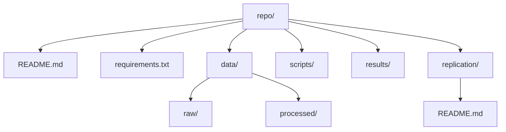

# Agentic Coding for Economists
## Day 4: Integration, Replication, Presentation
### Antonio Mele | Università di Milano-Bicocca | April 7–10, 2026

---

# Day 3 Recap

**What we built:**
- Full harness: subagents (pr-reviewer, replicator, bibliographer), skills (replication-checker, paper-polisher)
- Swarm orchestration: GitHub issues + labels (parallel vs. sequential), Cloud Agents per issue where appropriate
- Cloud Agents with branch handoff and review-before-merge
- Orchestration log, handoff files, merged PRs

**Safety rule:** No merge without consistency pass and replication check

---

# Day 4 Goals

1. **Replication protocol:** Clean-run checklist, fail-fix-rerun cycle
2. **Packaging:** README-first approach, sensible project structure, documented dependencies
3. **Post-workshop experiments:** Ideas to try individually or with colleagues over the next few weeks
4. **Wrap-up:** Transferable patterns, next steps

**Deliverables:** Mini replication package, replication README, 5–7 min presentation

---

# Clean-Run Checklist

**Before claiming "replication-ready":**
1. **Fresh clone:** `git clone` into a new directory
2. **Install deps:** `pip install -r requirements.txt` (or equivalent)
3. **Environment:** Copy `.env.example` to `.env`; fill placeholders (no secrets in git)
4. **Run command:** One documented command from repo root (e.g. `python scripts/run_analysis.py`)
5. **Output:** Reproducible outputs (same hash for same inputs)

**Economics focus:** Data paths portable, units documented, coefficient interpretation clear

---

# Common Replication Failures

- **Hardcoded paths:** `/Users/john/data/panel.csv` → use relative paths, `Path(__file__).parent`
- **Missing dependencies:** Script runs locally but fails for others → pin in `requirements.txt`
- **Secrets in code:** API keys, DB passwords → env vars, `.cursorignore`
- **Random seeds:** Non-reproducible figures/tables → set `np.random.seed(42)`
- **Data not documented:** Where to get raw data? Units? → `data/README.md`

---

# Replication README Structure

**Recommended layout for `replication/README.md` or `README.md`:**
1. **Requirements:** Python 3.10+, dependencies
2. **Data:** Where to obtain raw data (URL, citation); expected structure
3. **Setup:** `pip install -r requirements.txt`, copy `.env.example`
4. **Run:** Exact command(s) from repo root
5. **Output:** What files are produced and where
6. **Verify:** Expected hash or sample stats for validation

---

# Fail-Fix-Rerun Cycle

**Verification loop:**
1. Run the pipeline from scratch (or ask a colleague)
2. If it fails: document the error, fix the blocker, commit
3. Re-run until success
4. Update `replication/README.md` with any new steps

**Use the replication-checker skill** to catch common issues before sharing

---

# README-First Approach

**The README is the entry point.**
- A colleague (or your future self) should understand the project in 2 minutes
- Sections: Overview, Requirements, Data, Setup, Run, Output, Citation
- Economics-specific: State the research question, data sources, key results

**Example:** "This repo replicates the main results in [Author (Year)]. Data: NBER CPS. Run: `python scripts/run_replication.py`."

---

# Project Structure

| Path | Purpose |
|------|---------|
| `README.md` | Entry point, run instructions |
| `data/raw/`, `data/processed/` | Raw and intermediate data |
| `scripts/` | Analysis, estimation, figures |
| `results/` | Final tables, figures |
| `replication/README.md` | Clean-run protocol |

---

# Experiments to Try (Next Few Weeks)

**Pick a few; swap notes with a colleague.**

- **Replication buddy:** Pair up; each clones the other's repo and runs the documented clean-run command; fix whatever breaks.
- **Issue-only week:** No code change without a GitHub issue (even self-assigned); practice parallel vs. sequential labels.
- **One Cloud Agent task:** Delegate one long, bounded job to a Cloud Agent; capture outcome in `notes/orchestration_log.md`.
- **Skill or subagent:** Add one project skill (e.g. replication-checker) or one `.cursor/agents/` definition for a recurring role.
- **Read-me first:** Rewrite `README.md` as if for a referee; ask a colleague if they can run the pipeline in under 15 minutes.
- **Consistency pass:** Before merging any PR, run your review + replication checklist (manual or agent-assisted).
- **Economics slice:** Take one figure or table from a working paper draft and reproduce it from code with a single command.

---

# Building Habits Post-Workshop

- **Issue-driven workflow:** Every task starts with an issue
- **Review before merge:** Use pr-reviewer subagent (or equivalent)
- **Replication pass:** Run replication-checker before sharing code
- **Context discipline:** Tight @mentions for focused edits
- **Document as you go:** Update README and handoff files

**Transferability:** These patterns work with Claude Code, Codex, other agent platforms.

---

# What You Learned Over 4 Days

1. **Day 1:** Modes, rules, AGENTS.md, .cursorignore — agent mindset and context control
2. **Day 2:** Spec-driven development, literature map, research design, implementation tasks
3. **Day 3:** Subagents, skills, swarms, Cloud Agents — parallel orchestration
4. **Day 4:** Replication protocol, packaging — from prototype to mini research package

---

# Transferable Patterns Summary

- **Decomposition:** Issue-driven workflow, small deliverables
- **Context management:** Rules, ignore files, @mentions, codebase queries
- **Orchestration:** Issues as work units, labels for parallel/sequential work, role specialization, branch isolation
- **Verification loops:** Review before merge, replication check, fail-fix-rerun
- **File-driven handoffs:** Mailboxes, orchestration log, README-first

**Cursor-first, but patterns generalize.**

---

# Next Steps and Resources

**Immediate:**
- Deliver your 5–7 min presentation
- Complete replication README and clean-run
- Commit a short note listing which post-workshop experiments you will try first

**Resources:**
- Cursor docs: MCP, Cloud Agents, Subagents, Skills
- Optional supplementary exploration (one community pattern among many): https://github.com/steveyegge/gastown
- FRED API: https://fred.stlouisfed.org/docs/api/fred/
- Course repo: `docs/`, `spec/`, workshop modules

**Thank you!**
